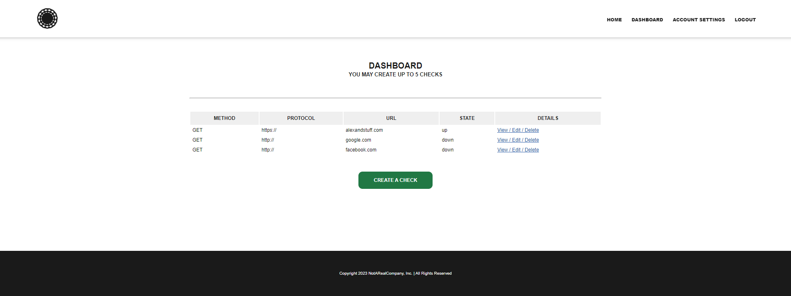
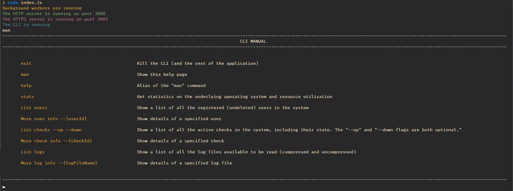

# Vanilla Node.js

Vanilla Node.js project from the Node.js Master Class course containing a REST Server, Web App and CLI.

Web App:

Cli:

## Resources

[Course Source Code](https://github.com/pirple/The-NodeJS-Master-Class)
